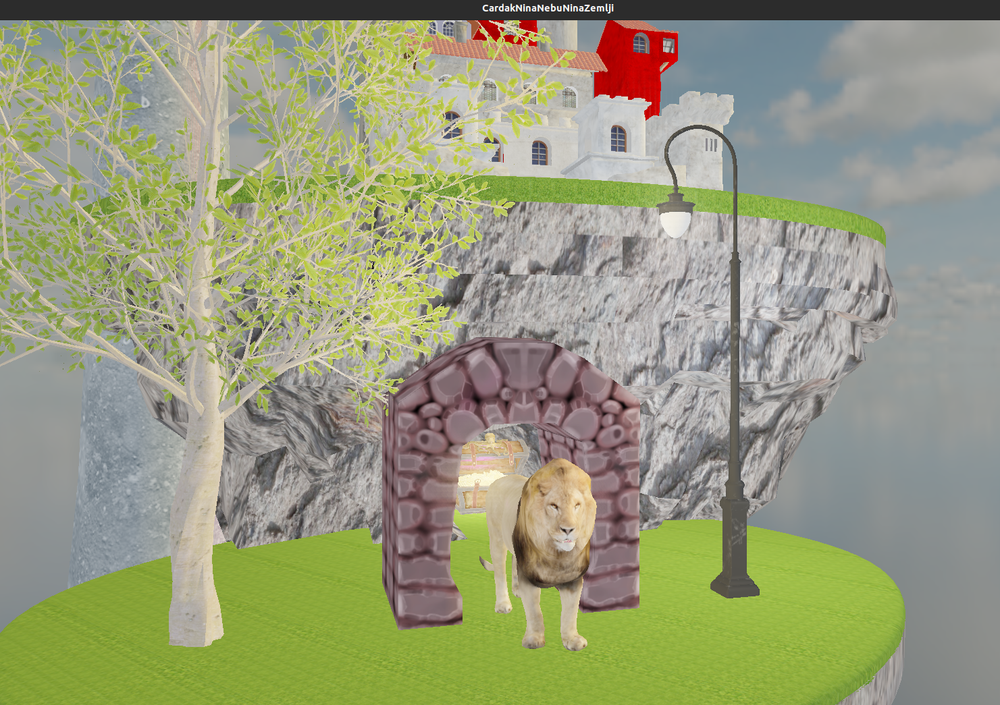
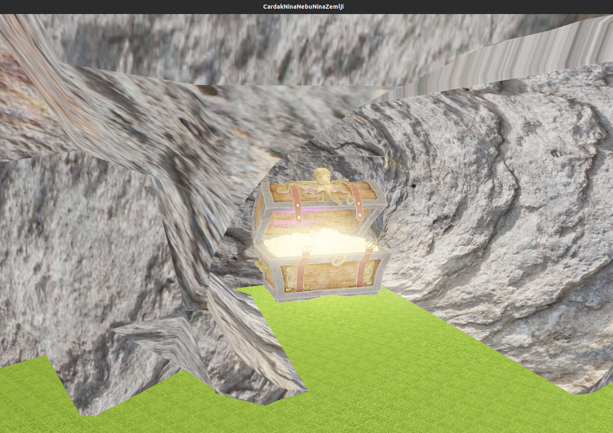

# CardakNinaNebu

Projekat iz Računarske Grafike

Implementirane oblasti :
 - Osnovne (1-8 nedelja)
 - Modeli
 - Cubemaps (Grupa A)
 - HDR (Grupa B), Bloom (Grupa B)

Face culling je primenjen na celu scenu, osim na drvo.

## Uputstvo

####  `WASD` - Kretanje po sceni

####  `L` - uključivanje / isključivanje lampe

####  `T` - uključivanje / isključivanje sjaja nad blagom

####  `H` -  uključivanje / isključivanje HDR efekta

####  `B` -  uključivanje / isključivanje bloom efekta

####  `I` - smanjivanje ekspozicije

####  `E` - povećavanje ekspozicije

####  `M` - uključivanje / isključivanje miša

## Resursi

#### Modeli: [sketchfab](sketchfab.com/feed) 
#### Skybox: [HDRI](https://polyhaven.com/) [Konverter](https://matheowis.github.io/HDRI-to-CubeMap/)

## Galerija

